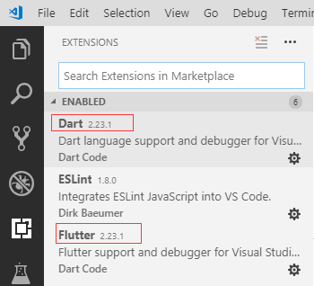
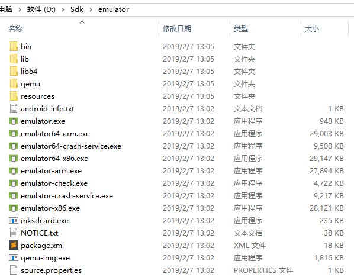
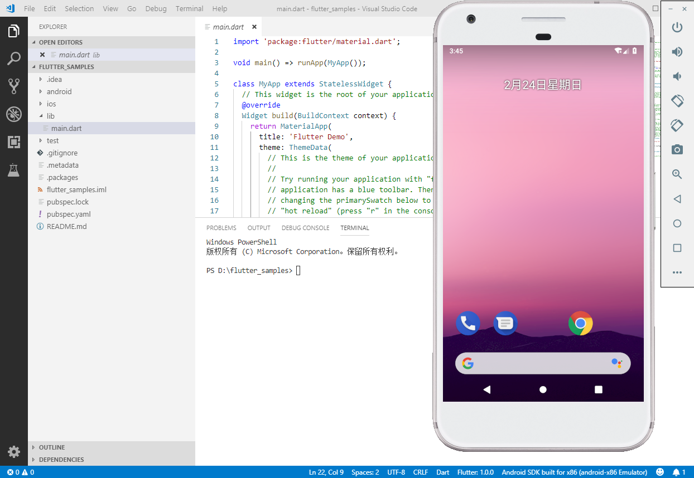
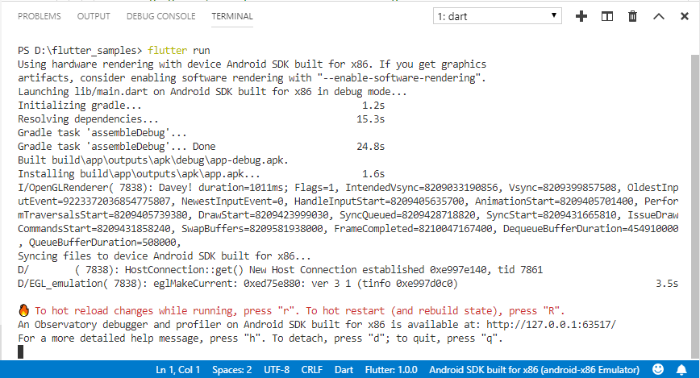
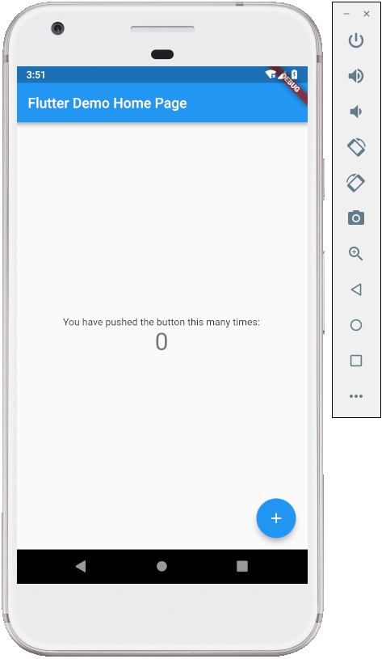

# Flutter开发环境搭建和调试
------ 
Flutter开发工具很多，有很多支持Flutter开发的IDE。比如Android Studio、Visual Studio Code、InteIIiJ IDEA、Atom、Komodo等。这里将使用Visual Studio Code作为主要开发工具，因为Visual Studio Code占用内存和CPU比较低，非常的流畅，体验也比较的好。模拟器的话，这里推荐使用Android官方的模拟器，也就是Android Studio SDK里带的模拟器。不过，这里的模拟器我们使用单独启动的，无需从Android Studio启动，当然也可以用真机运行调试。接下来，我们就开始Flutter开发环境的搭建吧。注意：本文是在Windows环境下安装的开发环境。本文将主要介绍：
> * Flutter下载与环境变量配置
> * Visual Studio Code插件安装与新建Flutter项目
> * 模拟器的安装
> * 运行Flutter项目到模拟器和真机
> * Flutter常用命令

------

## 开发环境的搭建

### 1. 下载Flutter SDK

Flutter SDK由两部分构成，一个是Dart SDK，另一个就是Flutter SDK，因为Flutter是基于Dart的。可以通过两种方式下载：一种是Git下载；另一种是直接下载SDK压缩包即可。
Git方式我们可以通过拉取官方Github上的flutter分支来下载。分支分类如下图：


可以看到主要有dev、beta和stable三个官方分支使，这里正式开发的话可以下载stable稳定版本。用Git命令进行下载stable分支：

```java
git clone -b stable https://github.com/flutter/flutter.git
```

另一种是直接官网下载SDK压缩包，官方下载地址为：

```java
https://storage.googleapis.com/flutter_infra/releases/stable/windows/flutter_windows_v1.0.0-stable.zip
```

### 2. 配置环境变量

下载完SDK后我们可以把它解压放到指定文件夹里，接下来就是配置SDK环境变量量，这样我们就可以在需要的目录执行相关命令了。如果在官网更新下载SDK慢的话，可以设置国内的镜像代理地址，这样下载会快一些。可以将如下的国内下载镜像地址加入到环境变量中：

```java
变量名：PUB_HOSTED_URL，变量值：https://pub.flutter-io.cn
变量名：FLUTTER_STORAGE_BASE_URL，变量值：https://storage.flutter-io.cn
```

Flutter SDK环境变量，讲flutter的bin目录加入环境变量即可：

```java
[你的Flutter文件夹路径]\flutter\bin
```

这样我们的Flutter SDK的环境变量就配置完毕了。接下来在命令提示符窗口中输入命令：

```java
flutter doctor
```

它可以帮助我们检查Flutter环境变量是否设置成功，Android SDK是否下载以及配置好环境变量等等。如果有相关的错误提示，根据提示进行修复和安装、设置即可。每次运行这个命令，都会帮你检查是否缺失了必要的依赖。通过运行flutter doctor命令来验证你是否已经正确地设置了，并且可以自动更新和下载相关的依赖。如果全部配置正确的话，会出现如下类似的检测信息：


主要检测信息为：Flutter、Android toolchain、Connected device。 

### 3．安装Visual Studio Code所需插件

在Visual Studio Code的Extensions里搜索安装Dart和Flutter扩展插件：



安装完成插件后，重启Visual Studio Code编辑器即可。

### 4．创建Flutter项目

接下来进行Flutter项目的新建，我们可以通过命令面板或者快捷键Ctrl+Shif+P打开命令面板，找到Flutter：New Project：


点击New Project，接下来进入项目名称输入：


回车，然后选择好项目的存储位置即可，这样就完成了Flutter项目的新建。
整个的创建流程日志如下：

```java
[undefined] flutter create .
Waiting for another flutter command to release the startup lock...
Creating project ....
  .gitignore (created)
  .idea\libraries\Dart_SDK.xml (created)
  .idea\libraries\Flutter_for_Android.xml (created)
  .idea\libraries\KotlinJavaRuntime.xml (created)
  .idea\modules.xml (created)
  .idea\runConfigurations\main_dart.xml (created)
  .idea\workspace.xml (created)
  .metadata (created)
  android\app\build.gradle (created)
  android\app\src\main\java\com\example\fluttersamples\MainActivity.java (created)
  android\build.gradle (created)
  android\flutter_samples_android.iml (created)
  android\app\src\main\AndroidManifest.xml (created)
  android\app\src\main\res\drawable\launch_background.xml (created)
  android\app\src\main\res\mipmap-hdpi\ic_launcher.png (created)
  android\app\src\main\res\mipmap-mdpi\ic_launcher.png (created)
  android\app\src\main\res\mipmap-xhdpi\ic_launcher.png (created)
  android\app\src\main\res\mipmap-xxhdpi\ic_launcher.png (created)
  android\app\src\main\res\mipmap-xxxhdpi\ic_launcher.png (created)
  android\app\src\main\res\values\styles.xml (created)
  android\gradle\wrapper\gradle-wrapper.properties (created)
  android\gradle.properties (created)
  android\settings.gradle (created)
  ios\Runner\AppDelegate.h (created)
  ios\Runner\AppDelegate.m (created)
  ios\Runner\main.m (created)
  ios\Runner.xcodeproj\project.pbxproj (created)
  ios\Runner.xcodeproj\xcshareddata\xcschemes\Runner.xcscheme (created)
  ios\Flutter\AppFrameworkInfo.plist (created)
  ios\Flutter\Debug.xcconfig (created)
  ios\Flutter\Release.xcconfig (created)
  ios\Runner\Assets.xcassets\AppIcon.appiconset\Contents.json (created)
  ios\Runner\Assets.xcassets\AppIcon.appiconset\Icon-App-1024x1024@1x.png (created)
  ios\Runner\Assets.xcassets\AppIcon.appiconset\Icon-App-20x20@1x.png (created)
  ios\Runner\Assets.xcassets\AppIcon.appiconset\Icon-App-20x20@2x.png (created)
  ios\Runner\Assets.xcassets\AppIcon.appiconset\Icon-App-20x20@3x.png (created)
  ios\Runner\Assets.xcassets\AppIcon.appiconset\Icon-App-29x29@1x.png (created)
  ios\Runner\Assets.xcassets\AppIcon.appiconset\Icon-App-29x29@2x.png (created)
  ios\Runner\Assets.xcassets\AppIcon.appiconset\Icon-App-29x29@3x.png (created)
  ios\Runner\Assets.xcassets\AppIcon.appiconset\Icon-App-40x40@1x.png (created)
  ios\Runner\Assets.xcassets\AppIcon.appiconset\Icon-App-40x40@2x.png (created)
  ios\Runner\Assets.xcassets\AppIcon.appiconset\Icon-App-40x40@3x.png (created)
  ios\Runner\Assets.xcassets\AppIcon.appiconset\Icon-App-60x60@2x.png (created)
  ios\Runner\Assets.xcassets\AppIcon.appiconset\Icon-App-60x60@3x.png (created)
  ios\Runner\Assets.xcassets\AppIcon.appiconset\Icon-App-76x76@1x.png (created)
  ios\Runner\Assets.xcassets\AppIcon.appiconset\Icon-App-76x76@2x.png (created)
  ios\Runner\Assets.xcassets\AppIcon.appiconset\Icon-App-83.5x83.5@2x.png (created)
  ios\Runner\Assets.xcassets\LaunchImage.imageset\Contents.json (created)
  ios\Runner\Assets.xcassets\LaunchImage.imageset\LaunchImage.png (created)
  ios\Runner\Assets.xcassets\LaunchImage.imageset\LaunchImage@2x.png (created)
  ios\Runner\Assets.xcassets\LaunchImage.imageset\LaunchImage@3x.png (created)
  ios\Runner\Assets.xcassets\LaunchImage.imageset\README.md (created)
  ios\Runner\Base.lproj\LaunchScreen.storyboard (created)
  ios\Runner\Base.lproj\Main.storyboard (created)
  ios\Runner\Info.plist (created)
  ios\Runner.xcodeproj\project.xcworkspace\contents.xcworkspacedata (created)
  ios\Runner.xcworkspace\contents.xcworkspacedata (created)
  lib\main.dart (created)
  flutter_samples.iml (created)
  pubspec.yaml (created)
  README.md (created)
  test\widget_test.dart (created)
Running "flutter packages get" in flutter_samples...            11.8s
Wrote 64 files.

All done!
[√] Flutter is fully installed. (Channel stable, v1.0.0, on Microsoft Windows [Version 10.0.17134.590], locale zh-CN)
[√] Android toolchain - develop for Android devices is fully installed. (Android SDK 28.0.3)
[√] Android Studio is fully installed. (version 3.3)
[√] IntelliJ IDEA Community Edition is fully installed. (version 2018.3)
[!] Connected device is not available.

Run "flutter doctor" for information about installing additional components.

In order to run your application, type:

  $ cd .
  $ flutter run

Your application code is in .\lib\main.dart.

exit code 0
```

Flutter项目结构如下：


其中，Android相关的修改和配置在android目录下，结构和Android应用项目结构一样；IOS相关修改和配置在ios目录下，结构和IOS应用项目结构一样。最重要的flutter代码文件是在lib目录下，类文件以.dart结尾，语法结构为Dart语法结构。大致如下：

```dart
import 'package:flutter/material.dart';

void main() => runApp(MyApp());

class MyApp extends StatelessWidget {
  // This widget is the root of your application.
  @override
  Widget build(BuildContext context) {
    return MaterialApp(
      title: 'Flutter Demo',
      theme: ThemeData(
        // This is the theme of your application.
        //
        // Try running your application with "flutter run". You'll see the
        // application has a blue toolbar. Then, without quitting the app, try
        // changing the primarySwatch below to Colors.green and then invoke
        // "hot reload" (press "r" in the console where you ran "flutter run",
        // or simply save your changes to "hot reload" in a Flutter IDE).
        // Notice that the counter didn't reset back to zero; the application
        // is not restarted.
        primarySwatch: Colors.blue,
      ),
      home: MyHomePage(title: 'Flutter Demo Home Page'),
    );
  }
}

class MyHomePage extends StatefulWidget {
  MyHomePage({Key key, this.title}) : super(key: key);

  // This widget is the home page of your application. It is stateful, meaning
  // that it has a State object (defined below) that contains fields that affect
  // how it looks.

  // This class is the configuration for the state. It holds the values (in this
  // case the title) provided by the parent (in this case the App widget) and
  // used by the build method of the State. Fields in a Widget subclass are
  // always marked "final".

  final String title;

  @override
  _MyHomePageState createState() => _MyHomePageState();
}

class _MyHomePageState extends State<MyHomePage> {
  int _counter = 0;

  void _incrementCounter() {
    setState(() {
      // This call to setState tells the Flutter framework that something has
      // changed in this State, which causes it to rerun the build method below
      // so that the display can reflect the updated values. If we changed
      // _counter without calling setState(), then the build method would not be
      // called again, and so nothing would appear to happen.
      _counter++;
    });
  }

  @override
  Widget build(BuildContext context) {
    // This method is rerun every time setState is called, for instance as done
    // by the _incrementCounter method above.
    //
    // The Flutter framework has been optimized to make rerunning build methods
    // fast, so that you can just rebuild anything that needs updating rather
    // than having to individually change instances of widgets.
    return Scaffold(
      appBar: AppBar(
        // Here we take the value from the MyHomePage object that was created by
        // the App.build method, and use it to set our appbar title.
        title: Text(widget.title),
      ),
      body: Center(
        // Center is a layout widget. It takes a single child and positions it
        // in the middle of the parent.
        child: Column(
          // Column is also layout widget. It takes a list of children and
          // arranges them vertically. By default, it sizes itself to fit its
          // children horizontally, and tries to be as tall as its parent.
          //
          // Invoke "debug painting" (press "p" in the console, choose the
          // "Toggle Debug Paint" action from the Flutter Inspector in Android
          // Studio, or the "Toggle Debug Paint" command in Visual Studio Code)
          // to see the wireframe for each widget.
          //
          // Column has various properties to control how it sizes itself and
          // how it positions its children. Here we use mainAxisAlignment to
          // center the children vertically; the main axis here is the vertical
          // axis because Columns are vertical (the cross axis would be
          // horizontal).
          mainAxisAlignment: MainAxisAlignment.center,
          children: <Widget>[
            Text(
              'You have pushed the button this many times:',
            ),
            Text(
              '$_counter',
              style: Theme.of(context).textTheme.display1,
            ),
          ],
        ),
      ),
      floatingActionButton: FloatingActionButton(
        onPressed: _incrementCounter,
        tooltip: 'Increment',
        child: Icon(Icons.add),
      ), // This trailing comma makes auto-formatting nicer for build methods.
    );
  }
}
```

---

## 模拟器的安装与调试

项目新建完毕了，接下来就是编译运行Flutter项目到真机或者模拟器了。先说模拟器，模拟器在我们下载的Android SDK的目录里，可以通过两种方法创建模拟器，推荐在Android Studio里新建一个模拟器，点击进入AVD Manager，如果没有模拟器的话，就创建一个即可，可以选择最新的SDK：


创建完毕后，我们就可以在电脑的模拟器目录看到我们创建的模拟器里：


对应的模拟器AVD Manager相关也在Android SDK目录下：



接下来我们就可以关闭相关窗口了，建立一个bat文件，写入启动模拟器的命令，这样每次启动模拟器直接运行这个bat文件即可：

```java
D:\Sdk\emulator\emulator.exe -avd Pixel_XL_API_28
```

模拟器所在的SDK目录根据你的实际情况位置修改即可。


接下来，双击这个bat文件运行模拟器：



接着在项目所在目录运行flutter run命令即可编译运行flutter项目到模拟器上：



运行效果如下图：



运行成功后，后续运行调试只要不退出应用界面，就可以进行热重载，输入r进行热重载当前页面，输入R进行整个应用的热重启，输入h弹出帮助信息，输入d解除关联，输入q退出应用调试。如果遇到有多个模拟器或者模拟器和真机同时存在的话，可以通过-d参数加设备ID指定要运行的设备，例如：

```java
flutter run -d emulator-5556
```

可以通过flutter devices或adb devices命令查看目前已连接的设备信息。
还有一种命令方式创建模拟器，输入如下命令可以查看当前可用的模拟器：

```java
flutter emulator
```

输入以下命令可以创建指定名称的模拟器，默认创建的模拟器Android版本号为已安装的最新的SDK版本号：

```java
flutter emulators --create --name xyz
```

运行以下命令可以启动模拟器：

```java
flutter emulators --launch <emulator id>
```

<emulator id>替换为你的模拟器ID名称即可。
真机设备运行调试和模拟器的过程基本一样，手机和电脑通过USB连接，手机开启开发人员选项和USB调试，最后运行flutter run命令即可。
其他常用的命令如下：

```java
flutter build apk;           //打包Android应用
flutter build apk –release;
flutter install;              //安装应用
flutter build ios;            //打包IOS应用
flutter build ios –release;
flutter clean;               //清理重新编译项目
flutter upgrade;            //升级Flutter SDK和依赖包
flutter channel;            //查看Flutter官方分支列表和当前项目使用的Flutter分支
flutter channel <分支名>;   //切换分支
```

好了，Flutter开发环境搭建和调试就为大家讲解到这里了，有疑问可以及时反馈。


