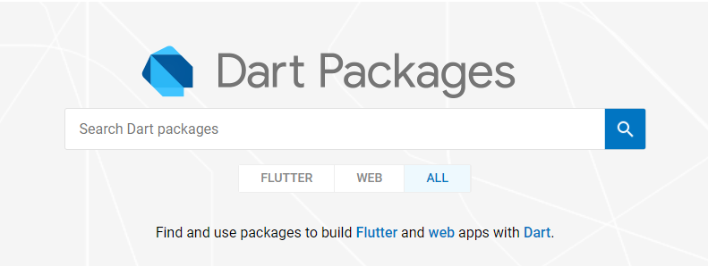
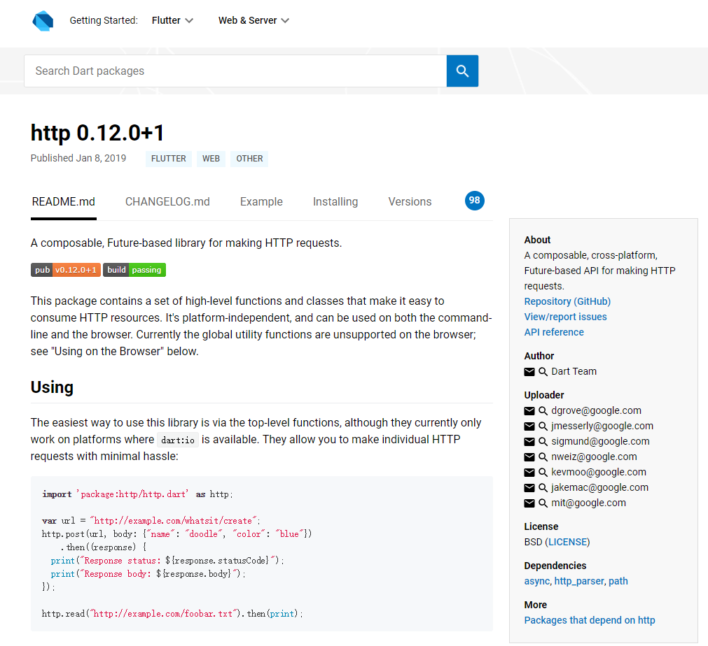
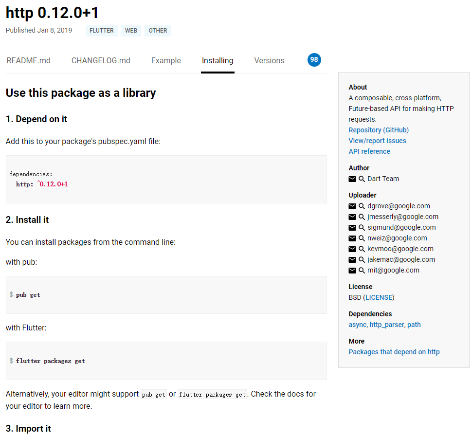
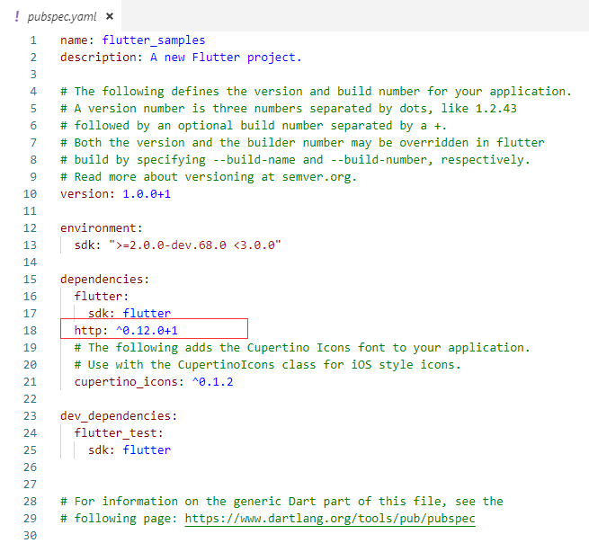
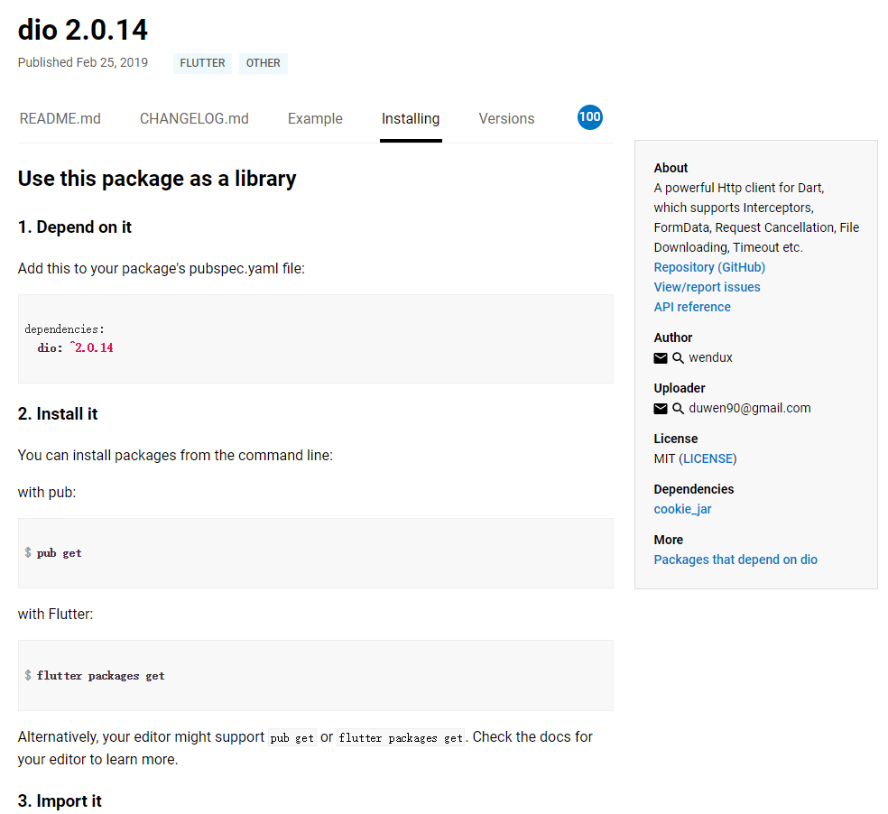

# Http网络请求详解

------ 

Http网络请求是一门开发语言里比较常用和重要的功能，主要用于资源访问、接口数据请求和提交、上传下载文件等等操作，Http请求方式主要有：GET、POST、HEAD、PUT、DELETE、TRACE、CONNECT、OPTIONS。本文主要GET和POST这两种常用请求在Flutter中的用法，其中对POST将进行着重讲解。Flutter的Http网络请求的实现主要分为三种：io.dart里的HttpClient实现、Dart原生http请求库实现、第三方库实现。后面将会给大家详细讲解这几种区别和特点及前两种的使用方法。接下来，我们就开始Flutter的Http网络请求详解吧。本文将主要介绍：

> * 简单介绍这几种Http请求方式
> * Flutter三种Http网络请求实现的区别和特点
> * HttpClient实现Http网络请求
> * Dart原生http请求库实现Http网络请求
> * 第三方库的推荐

------

## 1. Http的请求方式简介

Http网络请求方式就是描述了客户端想对指定的资源或服务器所要执行的操作。开头简介里介绍过，Http网络请求是一门开发语言里比较常用和重要的功能，主要用于资源访问、接口数据请求和提交、上传下载文件等等操作。其中主要的请求方式有：GET、POST、HEAD、PUT、DELETE、TRACE、CONNECT、OPTIONS这八种。接下来先简单介绍它们的特点和作用。

### 1.1 GET请求方式

从GET这个单词上也可以看出，它主要是执行获取资源操作的，例如通过URL从服务器获取返回的资源，其中GET可以把请求的一些参数信息拼接在URL上，传递给服务器，由服务器端进行参数信息解析，然后返回相应的资源给请求者。注意：GET请求拼接的URL数据大小和长度是有最大限制的，传输的数据量一般限制在2KB。

### 1.2 POST请求方式

POST主要是执行提交信息、传输信息的操作，POST请求的可以携带很多的数据，而且格式不限。如JSON、XML、文本等等都支持。并且POST传递的一些数据和参数不是直接拼接在URL后的，而是放在Http请求Body里，相对GET来说比较安全。并且传递的数据大小和格式是无限制的。POST请求方式是比较重要和常用的一种，POST请求包含两部分：请求头（header）和请求体（body）。POST请求常见的请求体（body）有三种传输内容类型Content-type：application/x-www-form-urlencoded、application/json、multipart/form-data，当然还有其他的几种，不过不常用，常用的就是这三种。

### 1.3 HEAD请求方式

HEAD主要是执行给请求的客户端返回头信息，而不返回Body主体内容。和GET方式类似，只不过GET方式有Body实体返回，而HEAD只返回头信息，无Body实体内容返回。主要是用于确认URL的有效性、资源更新的日期时间、查看服务器状态等等，对于有这方面需求的请求来说，比较不占用资源。

### 1.4 PUT请求方式

PUT主要是执行传输文件操作，类似于FTP的文件上传一样，请求里包含文件内容，并将此文件保存到URI指定的服务器位置。和POST方式的主要区别是：PUT请求方式如果前后两个请求相同，则后一个请求会把前一个请求覆盖掉，实现了PUT方式的修改资源；而POST请求方式如果前后两个请求相同，则后一个请求不会把前一个请求覆盖掉，实现了POST的增加资源。

### 1.5 DELETE请求方式

DELETE主要是执行告诉服务器想要删除的资源，执行删除指定资源操作。

### 1.6 OPTIONS请求方式

OPTIONS主要是执行查询针对所要请求的URI资源服务器所支持的请求方式，也就是获取这个URI所支持客户端提交给服务器端的请求方式有哪些。

### 1.7 TRACE请求方式

TRACE主要是执行追踪传输路径的操作，例如，我们发起了一个Http请求，在这个过程中这个请求可能会经过很多个路径和过程，TRACE就是告诉服务器在收到请求后，返回一条响应信息，将它收到的原始Http请求信息返回给客户端，这样就可以确认在Http传输过程中请求是否被修改过。

### 1.8 CONNECT请求方式

CONNECT主要就是执行连接代理操作，例如“翻墙”。客户端通过CONNECT方式与服务器建立通信隧道，进行TCP通信。主要通过SSL和TLS安全传输数据。CONNECT的作用就是告诉服务器让它代替客户端去请求访问某个资源，然后再将数据返回给客户端，相当于一个媒介中转。

## 2. Flutter Http网络请求实现的区别和特点

介绍完了Http几种请求方式，我们看下Flutter中的Http网络请求的实现方式。Flutter的Http网络请求的实现主要分为三种：io.dart里的HttpClient实现、Dart原生http请求库实现、第三方库实现。

**我们首先看下第一种：io.dart里的HttpClient实现。**

io.dart里的HttpClient实现的Http网络请求主要是实现了基本的网络请求，复杂一些的网络请求还无法完成。例如POST里的其他几种Body请求体传输内容类型部分还无法支持，multipart/form-data这个类型传输还不支持。所以如果你的一些Http网络请求可以通过io.dart里的HttpClient实现的话，用这个也可以完成要求。
那么接下来我们就看下io.dart里的HttpClient实现的Http网络请求实现步骤。

```dart
import 'dart:convert';
import 'dart:io';

class IOHttpUtils {
  //创建HttpClient
  HttpClient _httpClient = HttpClient();

  //要用async关键字异步请求
  getHttpClient() async {
    _httpClient
        .get('https://abc.com', 8090, '/path1')
        .then((HttpClientRequest request) {
      //在这里可以对request请求添加headers操作，写入请求对象数据等等
      // Then call close.
      return request.close();
    }).then((HttpClientResponse response) {
      // 处理response响应
      if (response.statusCode == 200) {
        response.transform(utf8.decoder).join().then((String string) {
          print(string);
        });
      } else {
        print("error");
      }
    });
  }

  getUrlHttpClient() async {
    var url = "https://abc.com:8090/path1";
    _httpClient.getUrl(Uri.parse(url)).then((HttpClientRequest request) {
      // Optionally set up headers...
      // Optionally write to the request object...
      // Then call close.
      return request.close();
    }).then((HttpClientResponse response) {
      // Process the response.
      if (response.statusCode == 200) {
        response.transform(utf8.decoder).join().then((String string) {
          print(string);
        });
      } else {
        print("error");
      }
    });
  }

  //进行POST请求
  postHttpClient() async {
    _httpClient
        .post('https://abc.com', 8090, '/path2')
        .then((HttpClientRequest request) {
      //这里添加POST请求Body的ContentType和内容
      //这个是application/json数据类型的传输方式
      request.headers.contentType = ContentType("application", "json");
      request.write("{\"name\":\"value1\",\"pwd\":\"value2\"}");
      return request.close();
    }).then((HttpClientResponse response) {
      // Process the response.
      if (response.statusCode == 200) {
        response.transform(utf8.decoder).join().then((String string) {
          print(string);
        });
      } else {
        print("error");
      }
    });
  }

  postUrlHttpClient() async {
    var url = "https://abc.com:8090/path2";
    _httpClient.postUrl(Uri.parse(url)).then((HttpClientRequest request) {
      //这里添加POST请求Body的ContentType和内容
      //这个是application/x-www-form-urlencoded数据类型的传输方式
      request.headers.contentType =
          ContentType("application", "x-www-form-urlencoded");
      request.write("name='value1'&pwd='value2'");
      return request.close();
    }).then((HttpClientResponse response) {
      // Process the response.
      if (response.statusCode == 200) {
        response.transform(utf8.decoder).join().then((String string) {
          print(string);
        });
      } else {
        print("error");
      }
    });
  }

  ///其余的HEAD、PUT、DELETE请求用法类似，大同小异，大家可以自己试一下
  ///在Widget里请求成功数据后，使用setState来更新内容和状态即可
  ///setState(() {
  ///    ...
  ///  });

}
```

**第二种：Dart原生http请求库实现。**

这里推荐这种方式使用，毕竟Dart原生的http请求库支持的Http请求比较全面，比较复杂的请求都可以实现，如上传和下载文件等等操作。

Dart目前官方的仓库里有大量的三方库和官方库，引用也非常的方便，Dart PUB官方地址为：https://pub.dartlang.org。
打开后如下图所示：



使用Dart原生http库，我们首先需要在Dart PUB或官方Github里把相关的http库引用下来。
在Dart PUB里搜索http，便可以查找到我们的http库，根据说明进行引用和使用即可。
http库官方Github库地址为：https://github.com/dart-lang/http



点击Installing，查看引用方法进行引用即可。



在项目的pubspec.yaml配置文件里加入引用：



完毕，这样就可以在dart文件类里直接import使用了。接下来给一个完整的使用例子：

```dart
import 'dart:convert';
import 'dart:io';

import 'package:http/http.dart' as http;
import 'package:http_parser/http_parser.dart';

class DartHttpUtils {
  //创建client实例
  var _client = http.Client();

  //发送GET请求
  getClient() async {
    var url = "https://abc.com:8090/path1?name=abc&pwd=123";
    _client.get(url).then((http.Response response) {
      //处理响应信息
      if (response.statusCode == 200) {
        print(response.body);
      } else {
        print('error');
      }
    });
  }

//发送POST请求，application/x-www-form-urlencoded
  postUrlencodedClient() async {
    var url = "https://abc.com:8090/path2";
    //设置header
    Map<String, String> headersMap = new Map();
    headersMap["content-type"] = "application/x-www-form-urlencoded";
    //设置body参数
    Map<String, String> bodyParams = new Map();
    bodyParams["name"] = "value1";
    bodyParams["pwd"] = "value2";
    _client
        .post(url, headers: headersMap, body: bodyParams, encoding: Utf8Codec())
        .then((http.Response response) {
      if (response.statusCode == 200) {
        print(response.body);
      } else {
        print('error');
      }
    }).catchError((error) {
      print('error');
    });
  }

  //发送POST请求，application/json
  postJsonClient() async {
    var url = "https://abc.com:8090/path3";
    Map<String, String> headersMap = new Map();
    headersMap["content-type"] = ContentType.json.toString();
    Map<String, String> bodyParams = new Map();
    bodyParams["name"] = "value1";
    bodyParams["pwd"] = "value2";
    _client
        .post(url,
            headers: headersMap,
            body: jsonEncode(bodyParams),
            encoding: Utf8Codec())
        .then((http.Response response) {
      if (response.statusCode == 200) {
        print(response.body);
      } else {
        print('error');
      }
    }).catchError((error) {
      print('error');
    });
  }

  // 发送POST请求，multipart/form-data
  postFormDataClient() async {
    var url = "https://abc.com:8090/path4";
    var client = new http.MultipartRequest("post", Uri.parse(url));
    client.fields["name"] = "value1";
    client.fields["pwd"] = "value2";
    client.send().then((http.StreamedResponse response) {
      if (response.statusCode == 200) {
        response.stream.transform(utf8.decoder).join().then((String string) {
          print(string);
        });
      } else {
        print('error');
      }
    }).catchError((error) {
      print('error');
    });
  }

// 发送POST请求，multipart/form-data，上传文件
  postFileClient() async {
    var url = "https://abc.com:8090/path5";
    var client = new http.MultipartRequest("post", Uri.parse(url));
    http.MultipartFile.fromPath('file', 'sdcard/img.png',
            filename: 'img.png', contentType: MediaType('image', 'png'))
        .then((http.MultipartFile file) {
      client.files.add(file);
      client.fields["description"] = "descriptiondescription";
      client.send().then((http.StreamedResponse response) {
        if (response.statusCode == 200) {
          response.stream.transform(utf8.decoder).join().then((String string) {
            print(string);
          });
        } else {
          response.stream.transform(utf8.decoder).join().then((String string) {
            print(string);
          });
        }
      }).catchError((error) {
        print(error);
      });
    });
  }
  ///其余的HEAD、PUT、DELETE请求用法类似，大同小异，大家可以自己试一下
  ///在Widget里请求成功数据后，使用setState来更新内容和状态即可
  ///setState(() {
  ///    ...
  ///  });
}
```

**第三种：第三方库实现。**

Flutter第三方库有很多可以实现Http网络请求，例如国内开发者开发的dio库，dio支持多个文件上传、文件下载、并发请求等复杂的操作。在Dart PUB上可以搜索dio。



在项目的pubspec.yaml配置文件里加入引用：

```dart
dependencies:
  dio: ^2.0.14
```

这样就可以引用dio的API库来实现Http网络请求了。给一个完整的dio用法例子：

```dart
import 'dart:io';

import 'package:dio/dio.dart';

class DartHttpUtils {
  //配置dio，通过BaseOptions
  Dio _dio = Dio(BaseOptions(
      baseUrl: "https://abc.com:8090/",
      connectTimeout: 5000,
      receiveTimeout: 5000));

  //dio的GET请求
  getDio() async {
    var url = "/path1?name=abc&pwd=123";
    _dio.get(url).then((Response response) {
      if (response.statusCode == 200) {
        print(response.data.toString());
      }
    });
  }

  getUriDio() async {
    var url = "/path1?name=abc&pwd=123";
    _dio.getUri(Uri.parse(url)).then((Response response) {
      if (response.statusCode == 200) {
        print(response.data.toString());
      }
    }).catchError((error) {
      print(error.toString());
    });
  }

//dio的GET请求，通过queryParameters配置传递参数
  getParametersDio() async {
    var url = "/path1";
    _dio.get(url, queryParameters: {"name": 'abc', "pwd": 123}).then(
        (Response response) {
      if (response.statusCode == 200) {
        print(response.data.toString());
      }
    }).catchError((error) {
      print(error.toString());
    });
  }

//发送POST请求，application/x-www-form-urlencoded
  postUrlencodedDio() async {
    var url = "/path2";
    _dio
        .post(url,
            data: {"name": 'value1', "pwd": 123},
            options: Options(
                contentType:
                    ContentType.parse("application/x-www-form-urlencoded")))
        .then((Response response) {
      if (response.statusCode == 200) {
        print(response.data.toString());
      }
    }).catchError((error) {
      print(error.toString());
    });
  }

  //发送POST请求，application/json
  postJsonDio() async {
    var url = "/path3";
    _dio
        .post(url,
            data: {"name": 'value1', "pwd": 123},
            options: Options(contentType: ContentType.json))
        .then((Response response) {
      if (response.statusCode == 200) {
        print(response.data.toString());
      }
    }).catchError((error) {
      print(error.toString());
    });
  }

  // 发送POST请求，multipart/form-data
  postFormDataDio() async {
    var url = "/path4";
    FormData _formData = FormData.from({
      "name": "value1",
      "pwd": 123,
    });
    _dio.post(url, data: _formData).then((Response response) {
      if (response.statusCode == 200) {
        print(response.data.toString());
      }
    }).catchError((error) {
      print(error.toString());
    });
  }

  // 发送POST请求，multipart/form-data，上传文件
  postFileDio() async {
    var url = "/path5";
    FormData _formData = FormData.from({
      "description": "descriptiondescription",
      "file": UploadFileInfo(File("./example/upload.txt"), "upload.txt")
    });
    _dio.post(url, data: _formData).then((Response response) {
      if (response.statusCode == 200) {
        print(response.data.toString());
      }
    }).catchError((error) {
      print(error.toString());
    });
  }

  //dio下载文件
  downloadFileDio() {
    var urlPath = "https://abc.com:8090/";
    var savePath = "./abc.html";
    _dio.download(urlPath, savePath).then((Response response) {
      if (response.statusCode == 200) {
        print(response.data.toString());
      }
    }).catchError((error) {
      print(error.toString());
    });
  }

  ///其余的HEAD、PUT、DELETE请求用法类似，大同小异，大家可以自己试一下
  ///在Widget里请求成功数据后，使用setState来更新内容和状态即可
  ///setState(() {
  ///    ...
  ///  });
}
```

好了，Flutter的Http网络请求详解就为大家讲解到这里了，有疑问可以及时反馈。

